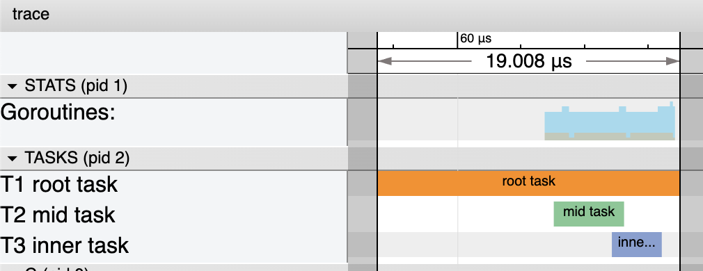

# Graceful Golang Task Lifecycle Management

[](https://pkg.go.dev/vawter.tech/stopper)
[](https://codecov.io/gh/bobvawter/go-stopper)

```shell
go get vawter.tech/stopper
```

This package contains a utility for gracefully terminating long-running tasks
within a Go program. A `stopper.Context` extends the stdlib `context.Context`
API with a soft-stop signal and includes task-launching APIs similar to
[`WaitGroup`](https://pkg.go.dev/sync#WaitGroup) or
[`ErrGroup`](https://pkg.go.dev/golang.org/x/sync/errgroup). This API supports
nested contexts for use-cases where tasks may be hierarchical in nature.

## API Use

There are a number of
[examples](https://pkg.go.dev/vawter.tech/stopper#pkg-examples) in the package
docs showing a variety of usecase patterns for polling and callback-style network servers.

## Tracing
Stopper also interoperates with `runtime/trace` or other modules that create
custom `context.Context` instances by way of the
[`stopper.Context.With()`](https://pkg.go.dev/vawter.tech/stopper#Context.With)
method.



## Project History

This repository was extracted from `github.com/cockroachdb/field-eng-powertools` using the command
`git filter-repo --subdirectory-filter stopper --path LICENSE` by the code's original author.
